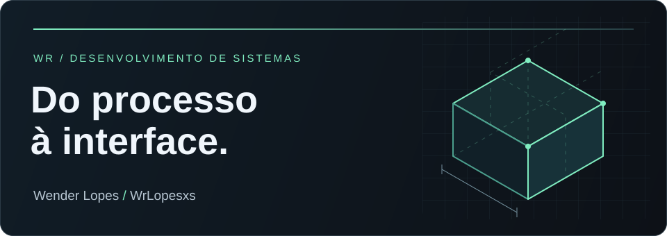
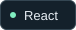

  

<h1 align="center">Wender Lopes</h1>

  <strong>Software para conectar processos, pessoas e operações.</strong> 
  Desenvolvimento de sistemas · Aplicações web · Automação

  <a href="#projetos-em-destaque">Projetos</a> &nbsp; / &nbsp;
  <a href="#tecnologias">Tecnologias</a> &nbsp; / &nbsp;
  <a href="mailto:wender.lopesxs@gmail.com">Contato</a>

---

## Do problema ao software

Sou Wender, desenvolvedor de sistemas. Meu foco está em automação de processos industriais, sistemas de gestão e aplicações web. Construo interfaces em TypeScript e React, APIs com Node.js e aplicações desktop com C#/.NET.

Os projetos aqui exploram problemas concretos: organizar pedidos, gerar orçamentos, aplicar regras de pontuação e levar ferramentas de modelagem 3D ao navegador. **Aprendo construindo e evoluindo essas soluções.**

## Projetos em destaque

### 01 / [WRCAD](https://github.com/WrLopesxs/WRCAD)

**Da ideia ao modelo 3D, direto no navegador.**

Ferramenta de modelagem com esboços 2D, extrusão, operações de corte e exportação STL para prototipagem e impressão 3D. Combina um motor geométrico com histórico de edição e uma interface de comandos.

TypeScript · React · Three.js · Zustand · Vite

[Explorar o código →](https://github.com/WrLopesxs/WRCAD)

---

### 02 / [Lojas Torres](https://github.com/WrLopesxs/Lojas_Torres)

**Do catálogo técnico ao orçamento.**

Aplicação com filtros de produtos e geração de orçamentos, organizada em um monorepo com interface React e API Express. O catálogo usa uma base de dados em arquivo, com estrutura para evolução da integração de estoque.

TypeScript · React · Node.js · Express · Vite

[Explorar o código →](https://github.com/WrLopesxs/Lojas_Torres)

---

### 03 / [Bolão Copa 2026](https://github.com/WrLopesxs/bolao-copa-2026)

**Regras de negócio que viram uma experiência compartilhada.**

Sistema de palpites com pontuação automática, ranking, autenticação e painel administrativo. A persistência combina PostgreSQL na nuvem com uma opção local em PGlite.

JavaScript · Node.js · Express · PostgreSQL · PGlite

[Explorar o código →](https://github.com/WrLopesxs/bolao-copa-2026)

---

### 04 / [WrSoftware](https://github.com/WrLopesxs/WrSoftware)

**Do balcão à cozinha, um fluxo de pedidos conectado.**

PDV para lanchonetes com registro de pedidos, tela de cozinha, controle de estoque e relatórios PDF. Um projeto de origem acadêmica voltado ao fluxo de atendimento, com sincronização por XML.

C# · .NET Framework · Windows Forms · SQL Server · iTextSharp

[Conhecer o projeto →](https://github.com/WrLopesxs/WrSoftware) · Código-fonte e banco disponíveis em arquivos ZIP no repositório.

<a href="https://github.com/WrLopesxs?tab=repositories">Ver todos os repositórios →</a>

## Tecnologias

Tecnologias presentes nos meus projetos, organizadas por área de aplicação.

**Interfaces web**

  
  
  
  

**APIs e desktop**

  
  
  

**Dados**

  
  

No fluxo de desenvolvimento: Vite, Tailwind CSS e GitHub Actions. Integrações com Google Apps Script e Google Sheets nos projetos de automação.

## Em exploração

Em [Money Empire](https://github.com/WrLopesxs/money-empire), exploro desenvolvimento de jogos com **Luau e Roblox**: progressão econômica, separação entre cliente e servidor e testes de regras de negócio. O projeto está em desenvolvimento, com validação visual no Studio ainda pendente na documentação.

## Vamos conversar

Para conversar sobre sistemas de gestão, automação ou aplicações web:

**[wender.lopesxs@gmail.com](mailto:wender.lopesxs@gmail.com)**

[GitHub · @WrLopesxs](https://github.com/WrLopesxs)

---

Do processo à interface. Uma solução de cada vez.

